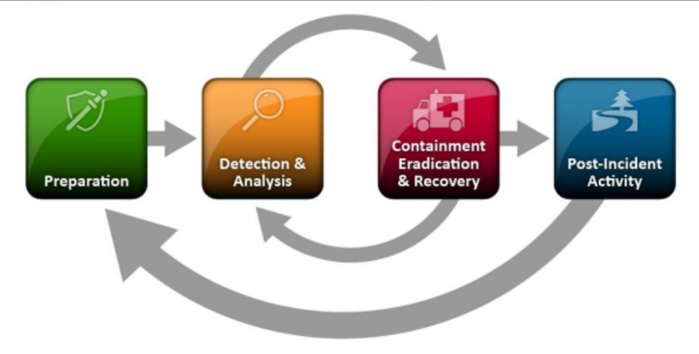

# Incident Response Process

Having an incident response plan in place is crucial. This plan provides the necessary framework and procedures to follow when a security event escalates into an incident, thereby preventing confusion and saving time. A well-documented plan outlines the steps for identifying, containing, mitigating, and recovering from an incident. The following sections will explain these aspects in detail:
- **Preparation**
- **Identification**
- **Containment**
- **Eradication**
- **Recovery**  
- and **Lessons Learned**

## Preparation

- Developing response plans for known incidents and running simulated scenarios
- Ensure resources are ready to use when an incident occurs ( software, forensic equipment, training, etc..)
- Implement continuous training for the staff and team handling security incidents.

## Identification (Retrieving Artifacts, IOCs)

**The five W's:**
a. **Who** were the victims, attackers of the compromise? *Servers, People, etc....*
b. **What** happened? *Compromised, breach?*
c. **When** did it happen? *Date and time*
d. **Where** did it happen? *Server, host machines, Email?*
e. **Why** did it happen? *To be determined..*

**Prioritize incident:**
- *Criticality Level* - How fast does the response need to be?
- *Impact Level* - How long will the incident impact business operations?

## Containment

It’s crucial to contain an incident so that it can’t spread and affect more systems causing additional damage and disruption. This section of the IRP should outline what actions should be taken to contain the incident by taking actions such as: 

1. **Disconnecting compromised devices from the internet preventing remote access or powering off systems.**
2. **Create backup or snapshot of image to preserve digital evidence.**

This stage is extremely important, as this is when digital evidence will be collected and preserved for later analysis, so containment measures need to be carefully considered, as powering off a system would result in losing crucial evidence that could be in volatile areas such as memory. Careful guidelines and procedures should be documented to allow for straightforward evidence acquisition and containment measures, both short-term and long-term.

Backups should be kept so that affected systems can be taken down and the backups can be used in their place, allowing normal business operations to continue.

## Eradication

Now that the incident is unable to spread to additional systems, analysis activities can be performed to work out exactly what happened. The *MITRE ATT&CK framework* can be used to work backward and potentially identify previous steps of the attack. 

1. **Begin analysis and identify root cause.**
2. **Remove malicious artifacts and malware.**
3. **Implement necessary defensive measures.**

The analysis will be conducted using methods such as looking at packet captures, reviewing logs from a SIEM, and working until the root cause has been identified. Guidelines should be provided to state how the analysis should be conducted, and appropriate resources should be provided such as software tools.

Once found, it’s time to start removing malicious artifacts such as the presence of malware, any changes to systems and settings made by malicious actors, and ensuring that any methods to retain persistence are removed so actors are not able to get back into systems.

At this point defensive measures should be taken to ensure that this type of incident can’t happen again by hardening systems, applying patches, and empowering automated defenses such as NIPS and HIPS using indicators of compromise gathered throughout the investigation. By creating run-books for different incidents, incident responders can quickly evaluate the suggested measures and implement them quickly to prevent additional incidents from occurring.

## Recovery

1. **Restore systems to earlier operations and baseline**.

This stage focuses on restoring business operations to normal by reintegrating affected systems into production environments after they have been cleaned and secured. Guidelines should be established to ensure systems are no longer infected and can safely resume business functions. For instance, if a website is compromised by web shells, granting attackers access to the server, a backup server could temporarily host the site. After thoroughly cleaning the infected server and removing all malicious elements, the site can be transferred back to the primary server.

## Lesson Learned 

1. **What did we learn?**
2. **How can we be better?**

After the investigation and response are complete, a meeting should be held with all stakeholders involved in the incident. This meeting should focus on reviewing the incident in detail, highlighting what went well, and identifying areas for improvement. Lessons learned from both real incidents and simulations can help strengthen systems against future attacks. Discussing the strengths and weaknesses of the response can lead to actionable changes, such as updating documentation, policies, and procedures, or securing additional budget for tools and personnel if necessary.

