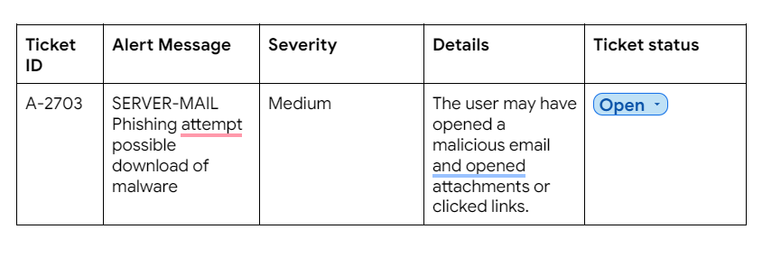

## Activity Overview

In this activity, you will respond to a phishing incident that involves a malicious file hash. This is the same SHA256 file hash that you investigated and verified as malicious in a [previous activity](https://www.coursera.org/learn/detection-and-response/quiz/wXUdm/activity-investigate-a-suspicious-file-hash). You'll follow playbook instructions to investigate and resolve the incident's alert ticket.

Previously, you learned how playbooks outline the step-by-step actions necessary to properly respond to a security incident. Coordinated, effective, and quick action is critical during incident response. A playbook can help security teams minimize the impact of an incident and reduce the incident response time. As a security analyst, playbooks can help guide you to effectively support an organization's incident response efforts.

## Scenario

Review the scenario. Then complete the step-by-step instructions.

You are a level-one security operations center (SOC) analyst at a financial services company. Previously, you received a phishing alert about a suspicious file being downloaded on an employee's computer. After investigating the email attachment file's hash, the attachment has already been verified malicious. Now that you have this information, you must follow your organization's process to complete your investigation and resolve the alert.

Your organization's security policies and procedures describe how to respond to specific alerts, including what to do when you receive a phishing alert. 

In the playbook, there is a flowchart and written instructions to help you complete your investigation and resolve the alert. At the end of your investigation, you will update the alert ticket with your findings about the incident.

_**Note**_: _Use the incident handler's journal you started in_ [_a previous activity_](https://www.coursera.org/learn/detection-and-response/exam/ghRgc/portfolio-activity-document-an-incident-with-an-incident-handlers-journal) _to take notes during the activity and keep track of your findings._

## Step 1: Evaluate ticket

## Step 2: Review the playbook and flowchart

![[images/Pasted image 20230822222043.png]]

## Step 3: Update the alert ticket status

![[images/Pasted image 20230822222345.png]]

## Step 4: Evaluate the alert

As a security analyst, you'll want to gain a complete understanding of why the alert was triggered. Create a new entry in your incident handler's journal to record the details of this security incident and gather your thoughts. You'll refer to these notes as you progress through the steps in the playbook.

Then, evaluate the contents of the **Alert ticket,** including the content in the **Additional information** section. Here are some examples of elements to examine when you are evaluating the alert ticket details:

- **Alert severity**: According to the playbook instructions, an alert severity of Medium or High is a good indication that a ticket might require escalation.
    
- **Sender details**: Analyzing the sender details of an email is important because it can reveal inconsistencies that can indicate a phishing attempt. Often, phishing emails try to impersonate trusted entities. For example, if there is a mismatch between the sender's email address and the sender's name, this is a good indication that the email might be a phishing email.
![[images/Pasted image 20230822223417.png]]

Comments: Multiple misspelling in this email indicate it may be phishy.
    
- **Message body**: It's important to analyze the message body (and subject line) of an email because phishing emails often contain grammatical errors, which can be an indication of a phishing attempt.
![[images/Pasted image 20230822223445.png]]

    
- **Attachments or links**: Phishing emails contain malicious links or attachments that are used to steal sensitive information or download malicious software or code on the recipient's device. Check to see whether a file has been attached to this email.

![[images/Pasted image 20230822223813.png]]

After you've evaluated the contents of the alert ticket, answer the 5 W's of this incident to gather the information you need to understand the nature of the alert. The 5 W's are:

- **Who caused the incident?** The user was targeted in a phishing campaign.
    
- **What happened?** The user received an email from a malicious actor posing as an applicant for a position. The email contained an attachment suggesting that it was the resume and cover letter of the applicant. Subsequently, the user opened the attachment releasing the malware on the endpoint device.
    
- **When did the incident take place?** July 20, 2022, at 9:30:14 AM in the morning, CST.
    
- **Where did the incident occur?** The incident occurred on the user’s HP Laptop, C-suite Edition endpoint device.
    
- **Why did it happen?** The user didn’t recognize phishing attempt and open the attachment, later recognized as a trojan horse malware.
    

At the end of this step, you should have 2-3 reasons on why you believe the phishing alert is or isn't legitimate.

### **Step 5: Determine whether the alert should be escalated**

After evaluating the alert details, use the Phishing Playbook's **Step 3.0** and **Step 3.1** to determine whether the email contains links or attachments and whether these links or attachments are malicious. Remember you've already determined that the email contains an attachment that has been verified as malicious through its file hash. 

Proceed to the Phishing Playbook's **Step 3.2** if you've determined that the alert should be escalated. If you've determined that the alert should not be escalated, proceed to the Phishing Playbook's **Step 4**.

### **Step 6: Update the alert ticket status**

Now that you've examined the email details, complete the final step of the playbook and update the alert ticket in the activity template. Depending on whether you want to escalate or close the alert:

- Under the **Ticket status** column of the alert ticket template, update the status of the ticket to either **Closed** or **Escalated**.
    
- Under the **Ticket comments** column of the alert ticket template, use the details you've found to explain the steps taken and why you chose to escalate or close the ticket. Include 2-3 reasons as to why you believe this alert should be escalated or closed.

![[images/Pasted image 20230822234415.png]]

## Conclusion
